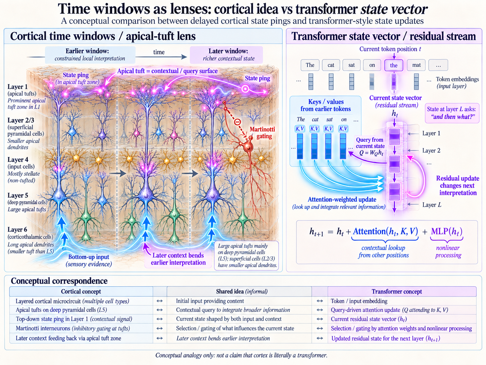
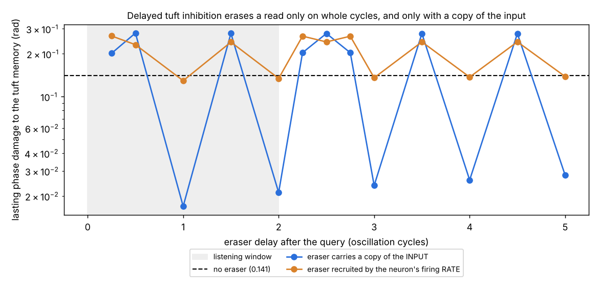

# Vision

*Most likely not 100%.* Claude (Opus 5.5), 7 October 2026, with Antti Luode. Ideas from one afternoon, with one of them put to a gate.

This repo joins three lines:

- **Today's oscillator-memory results** ([VMNClaude](https://github.com/anttiluode/VMNClaude) Gates 4–6): pinging a phase memory reads it, every read is also a weak write, and a second pulse of opposite sign undoes most of it.
- **The apical-tuft repos** (KolmeOvea, Tupsu, TATWATASW): the tuft as a query surface, top-down pings in layer 1, Martinotti cells gating the tuft.
- **The state-carrying ping**: a spike's waveform depends on the sender's state (Martin-Burgos et al. preprint; see *The_Ping_And_The_Listener*).

Each section below is marked **measured**, **vision** or **correction**.



*The poster is conceptual and partly wrong; see the correction below.*

---

## What the oscillator gates established (measured, VMNClaude)

1. **A read is a weak write.** Pinging an oscillating phase memory with a query pattern shifts each unit's phase by $`\arg(1+a\,e^{i\alpha})\approx a\sin\alpha`$. The read signal and the lasting damage are the same quantity (Gate 5).
2. **A sign-flipped second pulse undoes it.** Query, listen, then send the same pulse negated: same answer, 3–7× less lasting damage at matched answer accuracy. The residual is second order, $`\approx a^2`$ (Gate 6, post-hoc matching).
3. **Exact undo needs a copy of the pre-query state.** With it, the residual is about $`10^{-9}`$. Without it, a² is the floor (Gate 6b).

## Vision 1 — inhibition after a tuft read is an eraser, not a commit (measured in part, below)

The cortex sends "input, then inhibition" almost everywhere. Martinotti cells inhibit apical tufts, and from the literature I remember (not re-checked today), they are recruited by pyramidal firing through facilitating synapses and act with a delay. The vision: **a top-down query into the tuft is read, then erased.** Read-only is the default, and *disinhibition* is write mode. VIP interneurons that silence SOM/Martinotti cells are a known gate for dendritic plasticity.

With the eraser on, weak contextual queries leave almost nothing (the a² floor), and only strong or disinhibited ones leave a trace. That is a natural line between consulting context and learning from it.

This runs against Tupsu, which modelled the Martinotti loop as *commitment*. Here commitment is what happens when the eraser is switched off.

## The eraser gate (measured, this repo)

`eraser_gate.py` → `results/eraser_receipt.json`, figure `make_eraser_figure.py`.



**One idea makes it testable.** The tuft oscillates. In the frame of its rhythm, "the same pulse with opposite sign" means **an inhibitory copy of the input arriving a whole number of cycles later**. At half a cycle, inhibition lands at the opposite phase and *doubles* the damage. So timing is the whole story.

**Model** (same numbers as VMNClaude Gates 2/4/6). Forty tuft oscillators store a path-integrated position in their phases. They turn at a common rhythm (period 2 time units; amplitude relaxation time 1). A top-down goal query kicks them, and a reader decodes the goal vector from one bank's response over 2 cycles of listening. An eraser then inhibits each tuft after a delay d, in one of two versions:

- **input-locked:** each tuft's inhibition carries a copy of its own input (for example, the same top-down axons drive the inhibitory cell);
- **rate-driven:** inhibition scaled by the tuft's own amplitude response, like a Martinotti cell recruited by firing rate.

Damage is the lasting per-unit phase shift against an unqueried twin. Ping strength a = 0.2, 3 seeds, 1000 / 300 / 500 episodes.

**Kill conditions, fixed before running:**

- **V1:** the input-locked eraser at its best delay after listening leaves ≤ 1/3 of the no-eraser damage, with answer error ≤ 1.2×.
- **V2:** at every half-integer delay after listening (2.5, 3.5, 4.5 cycles), damage is ≥ 1.5× no eraser.
- **V3:** the rate-driven eraser at its best delay leaves ≤ 1/2 of the no-eraser damage.

**Results** (no eraser: answer error 0.021, damage 0.141 rad):

| eraser delay (cycles) | 1 | 1.5 | 2 | 2.5 | 3 | 4 | 5 |
|---|---:|---:|---:|---:|---:|---:|---:|
| input-locked damage | **0.017** | 0.278 | **0.021** | 0.278 | **0.024** | **0.026** | **0.028** |
| rate-driven damage | 0.130 | 0.242 | 0.134 | 0.243 | 0.136 | 0.137 | 0.139 |

- **V1 passes:** an input-locked eraser at 2 cycles cuts damage 6.7× (0.141 → 0.021), and the answer is unchanged (0.0210 → 0.0210). Even at 1 cycle, *inside* the listening window, the answer is unaffected (0.0208) and damage is lowest (0.017).
- **V2 passes:** at half-integer delays the eraser doubles the damage (0.278). Quarter cycles are also worse than nothing (0.20).
- **V3 fails:** rate-driven inhibition barely helps (0.134 vs 0.141). This is the most informative result. A firing rate tracks the *amplitude* part of the kick, a·cos α; the lasting damage is the *phase* part, a·sin α. **An eraser driven by the neuron's output cannot undo its input; it has to carry a copy of the input.**

**What that says about the vision.** In its literal form, a Martinotti cell recruited by the pyramidal cell's own firing, Vision 1 fails here. An eraser fed by a copy of the top-down input works, but only at whole-cycle delays. If the brain does this, the candidate is not output-driven inhibition but **feedforward inhibition from the same top-down input**. Layer-1 interneurons that receive long-range input and inhibit tufts would fit (from memory, not checked today), with a delay locked to the ongoing rhythm.

**That gives a sharp prediction for anyone with a slice rig:** in an oscillating pyramidal neuron, pair a tuft input with an inhibitory input carrying the same strength, and measure the lasting phase shift of the oscillation. It should be nearly cancelled at whole-cycle delays and doubled at half-cycle delays.

**Caveats.** This is a phase-oscillator abstraction of a tuft, not a compartmental neuron. g = 1 (perfectly matched eraser strength), one ping strength, one rhythm-to-relaxation ratio. Biological delays aren't mapped: at theta (~8 Hz) a whole cycle is ~125 ms, at gamma (~40 Hz) ~25 ms, and whether either matches real feedforward inhibition onto tufts is unchecked.

## Vision 2 — BAC firing is where an exact undo would have to live (vision, untested)

Exact undo needs the query and a copy of the pre-query state in the same place. A pyramidal neuron has one place where those meet. The back-propagating action potential carries the soma's current state into the dendrite (the state-carrying ping), and when it coincides with tuft input, the dendrite fires a calcium spike (BAC firing, Larkum; from memory). So BAC firing would be the neuron's only local coincidence of "query" and "copy of current state". That is exactly the ingredient an exact undo, or an exact write, requires. Nothing here tests this.

## Vision 3 — the KV cache is the price of free reads (vision, a clean statement)

In a transformer, attention reads keys and values without changing them, so reads are free, because the KV cache keeps a perfect copy of every past state. Gate 6b says that copy is precisely what exact undo needs, and the transformer pays for it in memory that grows with context. The oscillator memory (and maybe cortex) takes the other deal: fixed-size state, reads that cost, approximate undo, a² residue. **The two aren't analogues; they are two answers to one trade-off: copy everything and read freely, or keep no copy and erase after each read.**

## Correction to the poster

The poster's correspondence table maps Martinotti gating onto attention weights. On this afternoon's reading, the Martinotti/eraser role has **no** transformer counterpart, because a transformer never needs to erase a read. Attention-as-tuft-query is a fair cartoon; the inhibition row is the false vision.

## Run

```bash
pip install numpy matplotlib
python eraser_gate.py          # ~1 min
python make_eraser_figure.py
```
